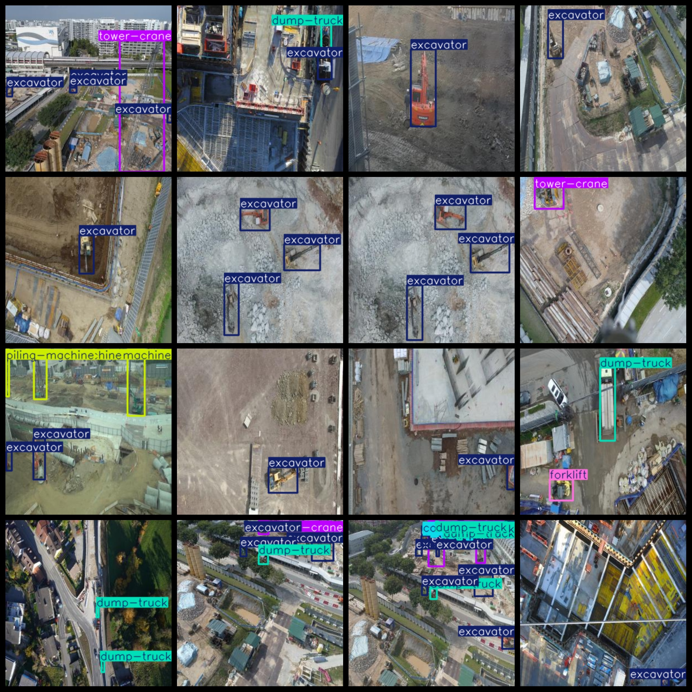

# Aerial Construction Site Engineering Vehicle Construction Machinery Dataset: 930 images, 10-class VOC+YOLO format.

The aerial construction site engineering vehicle and machinery dataset contains 930 images in the VOC+YOLO format. The dataset does not include a split path in the text file, but only includes JPG images and their corresponding VOC format XML files and YOLO format TXT files.

The number of images (JPG files): 930

The number of annotations (XML files): 930

The number of annotations (TXT files): 930

The number of annotation categories: 10

The repository where the dataset is located: datasets_sl

The number of annotation categories in the labels folder (according to the order in the yolo format, rather than the labels.txt file): ["bulldozer", "concrete-mixer", "concrete-pump", "dump-truck", "excavator", "forklift", "lifting-equipment", "piling-machine", "roller", "tower-crane"]

Chinese translation of the label descriptions: bulldozer, concrete mixer, concrete pump, dump truck, excavator, forklift, lifting equipment, piling machine, roller, tower crane

Box counts per category:

bulldozer boxes = 83

concrete mixer boxes = 195

concrete pump boxes = 14

dump truck boxes = 416

excavator boxes = 958

forklift boxes = 10

lifting equipment boxes = 48

piling machine boxes = 76

roller boxes = 10

tower crane boxes = 282

Total box count: 2092

Number of images per category:

bulldozer images = 51

concrete mixer images = 129

concrete pump images = 13

dump truck images = 309

excavator images = 555

forklift images = 10

lifting equipment images = 45

piling machine images = 55

roller images = 10

tower crane images = 234

Image resolution: 300x300

Annotation tool used: labelImg

Dataset enhancement status: No

Annotation rules: Draw rectangular boxes for each category

Important note: The dataset does not have separate training, validation, or test sets; you need to divide it yourself.

Special declaration: This dataset does not guarantee any accuracy of the trained models or weight files.

Annotation and image details are as follows:

## Images

---

Here is a pay link on Stripe (https://buy.stripe.com/3cs8yP7sY87d0vu9AB). Please contact me lonlonago@foxmail.com after funding $89, and I will send you a complete data files, thank you!

